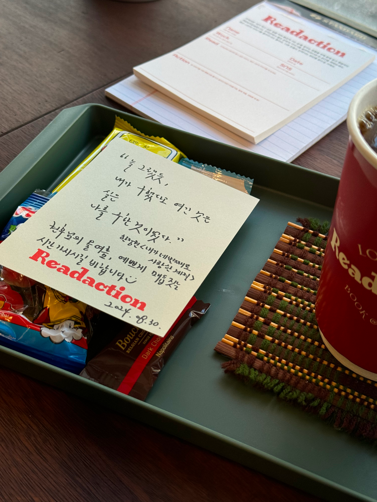

## 하고싶은 것은 많았습니다.

방학 기간이 두달이나 되기에 종강이 다가올때부터 고민이 있었는데요.

학교에서 경험하는 디자인 수업도 좋은 경험이었으나, 학기 중의 일정은 기술을 좋아해서 디자인까지 간 저로써는 **제품이나 기술 분야와 멀어지게 만들었고**
매주 과제가 있는 학과 특성상 한주의 연휴가 오기라도 하면 감사함과 동시에 무엇을 할까 고민하게 되는데 두달이라면 정말 무엇이던 할 수 있을것같다는 기분을 가지기에는 충분했습니다.

하지만 이 무엇이던 할 수 있을것 같다는 생각이 오히려 방심하게 만들기도 했습니다. 이는 뒤에서 다루도록 하고.

아무튼 7월 초 저는 대략적인 목표를 세우게 됩니다.

* 프로덕트 관련 경험을 한다.
* 대외활동을 하나 한다.
* 웹 프론트엔드 공부를 한다.
* 인문학적 교양을 채울 방법을 고민한다.

**이미 이때부터 개발만 하겠다고 선언한 것과 다를게 없었네요.**

어찌보면 계획대로 정직하게 보내게 되었습니다.

## Cony, 일기를 만들어 줘.

### Gemini Competition에 참가하다.

Google에서 여는 AI 기반 프로덕트 개발 대회인 [**Gemini API Developer Competition**](https://ai.google.dev/competition) 에 디자이너로 참가하였습니다.

여러분들은 일기를 마지막으로 써보신 적이 언제인가요? Cony는 일기를 쓰기 귀찮거나 시간이 부족한 현대인을 위해 Google의 생성형 인공지능인 **[Gemini](https://gemini.google.com)** 를 기반으로
**질문을 AI로 생성하고, 이를 음성인식 기술을 통해 답하는 형식**으로 일기를 자동으로 만들어주는 서비스입니다.

생성된 일기는 서비스에 저장되고, 이를 기반으로 마일스톤(장기목표)를 만들어주며, 조금 더 내용이 많아졌으면 하는 부분에 대해서는 내용 보충을 추천하기도 합니다.

Cony의 뜻은 **CON**vert to diar**Y** 입니다. 모 메신저의 캐릭터 이름같은 서비스 이름은 사실 별뜻 없었던것이죠. 어감만은 좋습니다.

### 생성형 인공지능을 위한 디자인을 고민하다.
제가 맡게된 프로젝트 중에서 인공지능을 사용하는 프로젝트는 Cony가 처음이였는데요.

해커톤이나 공모전, 외주 등을 통해서 경험하는 프로젝트들은 기능의 궤들이 크게 다르지 않았습니다.
기억을 되짚어보면 전에는 소셜 기능, 콘텐츠를 탐색하는 리스트 뷰, 구매 및 결제 등 기존에 있던 UI 패턴이나 레퍼런스 등을 보면서 비주얼적인 부분이나 어떻게 이 제품의 기획에 최적화 시킬 수 있을지 고민하는 경우가 많았는데요.

생성형 인공지능은 기존의 제품과 다른 상호작용 방식을 사용합니다. 제가 느끼는 가장 큰 차이는 기존의 제품은 내가 정보를 탐색해야 한다면, 생성형 인공지능을 사용하게 되면 그러한 기능을 사용자가 아닌 제품 스스로가 수행하게 된다는 점입니다.

Google와 같은 검색엔진에서 정보를 찾기 위해서는 여러 웹사이트를 직접 돌아가면서 **나에게 적합한 정보인지 판단하고, 아닌 경우에는 다시 찾는** 작업을 나 지신이 수행해야합니다.
GPT와 같은 인공지능으로 정보를 찾게 되면 **직접 찾을 필요없이 제품 내에서 알아서 정보를 가져오고, 적절히 가공하고, 다른 결과를 가져오게 하거나 정보의 평가**를 할수도 있습니다.

녹음 화면은 사용자나 저나 이제껏 경험해보지 못한 일기 작성 방식입니다.
- 질문을 강조해야 할것인가.
- **내가 원하는 일기를 쓰기 위해 그 질문을 어떤식으로 변경하게 할 것인가.**
- 내가 말하는것이 잘 녹음이 되고 있는지 텍스트 등으로 피드백을 주어야 할까.

와 같은 여러 요소들을 고민하면서 디자인 해왔던것 같습니다. 질문을 변경하고 싶을때 성향을 정하고 변경하게 할지, 질문 자체를 세로로 스와이핑 해가며 변경하게 할지도 고민하였습니다.

최종 디자인은 아래 건너뛰기 버튼을 만들어 세로 스와이핑 방식보다 넘기기 간단하게 만들면서, 내가 원하는 질문의 방향을 정하고 그 질문을 변경하고 싶을때는 빠르게 변경할 수 있게 하였습니다.
상단에 녹음 중이에요 메시지와 파형을 넣어 나의 말을 제대로 들을 수 있게 사용자에게 피드백을 주는 요소도 추가하였습니다.

인공지능 관련 서비스에 대해 도메인이 더 필요하다는것을 느낄 수 있는 계기가 되었습니다.

## 인공지능은 공상과학이 아니에요.

**[Google I/O Extended Pangyo 2024](https://festa.io/events/5353)** 에 참석하였습니다.

매해 Google에서는 개발자들을 위한 Google의 최신 기술을 소개하는 자리인 Google I/O를 열고 있는데요.

각 지역 Google Developers 그룹에서 Extended 행사를 열게 되는데 당해 I/O에서 중점적으로 다뤄진 기술이나 프로젝트에 대한 경험을 주제를 연사분들이 세션을 열어 경험이나 지식을 공유하는 행사입니다.

특히 AI/ML에 관련한 도메인이 부족한 저로써는 간혹 갈피를 잡기 어려운 세션들도 있었으나 **AI에 관련된 여러 담론이 오간** 올해 Extended Pangyo에서는
**Local AI가 Nvidia의 GPU가 이끌어온 어젠다에서 벗어나기 위한 방법 중 하나라는 점과, 기술에 친화적인 사람들도 AI를 업무에 21%정도밖에 활용하지 않는다** 와 같은 점도 배울 수 있었습니다.

단순히 개인정보 보호때문에 Local AI가 화두가 된걸까? AI를 업무에 활용하기에 핏이 항상 맞는건 아닌것같은데? AI가 너무 어려운것같고 약간 마법과 같은걸까? 와 같은 생각을 가지고 세션에 참석하였으나
이를 경험해오신 연사분들 덕에 AI에 대해서 활용할만하다는 점과 또 활용할 수 있는 방법을 고민할 수 있으면 좋겠다 라는 생각을 가지게 되었습니다.

그리고 저도 잘 쓰고 있는 **[Smart Spam Filter](https://apps.apple.com/kr/app/%EC%8A%A4%EB%A7%88%ED%8A%B8-%EC%8A%A4%ED%8C%B8-%ED%95%84%ED%84%B0-%EB%98%91%EB%98%91%ED%95%9C-ai%EA%B0%80-%EC%9E%A1%EC%95%84%EC%A3%BC%EB%8A%94-%EC%8A%A4%ED%8C%B8-%EC%B0%A8%EB%8B%A8%EC%95%B1/id6503603784)**
의 개발자이신 이준범님도 마지막에 연사로 참여하셨습니다.

스마트 스팸 필터는 개발자이신 이준범님이 본인의 iCloud 메시지 보관함에 저장되어있던 스팸 문자를 학습시켜 만든 LLM 기반의 스팸 차단 애플리케이션 인데요. 저는 이 애플리케이션으로 각종 주식과 사다리게임 권고에서 벗어날 수 있었습니다.
아이폰을 사용하시고, 스팸 문자가 고민이시라면 적극 추천드립니다.

**[App Store - Smart Spam Filter](https://apps.apple.com/kr/app/%EC%8A%A4%EB%A7%88%ED%8A%B8-%EC%8A%A4%ED%8C%B8-%ED%95%84%ED%84%B0-%EB%98%91%EB%98%91%ED%95%9C-ai%EA%B0%80-%EC%9E%A1%EC%95%84%EC%A3%BC%EB%8A%94-%EC%8A%A4%ED%8C%B8-%EC%B0%A8%EB%8B%A8%EC%95%B1/id6503603784)**

이번에는 코로나와 병역의무가 겹쳐 오랜만에 GDG Pangyo의 행사에 참석하였는데요. 오가나이저 분들의 구성원이 많이 바뀌었지만 또 알아봐주시는 분도 계셔서 개인적으로도 기쁜 시간이였습니다.

Instagram 이벤트에 당첨되어 Pangyo 모자를 얻기도 하였습니다.

## 개발하는 디자이너의 꿈.
저는 컴퓨터로 무언가 만들어내는게 좋아서 라는 이유로 디자인을 시작하게 되었습니다.

제가 프로그래밍을 배우려고 한 첫 시도가 있던 2014년에는 자고로 프로그래밍은 C언어 책사두고 별로 점찍는거 공부하는 것이 정석으로 여겨지던 시대였는데요.

CS적으로는 맞는 접근이지만, 눈에 보이는 프로덕트를 만들고 싶었던 저에게는 좋게 말하면 정석적이지만 한편으론 다소 고달픈 방법이기도 했습니다.

당시 친구띠라 시작한 포토샵으로 2016년에 청소년 해커톤 AppJam에서 제가 디자인을 맡으며 수상 경험을 하고 이후 여러 대외활동을 하면서 프로그래밍이라는 방법은 아니지만 프로덕트를 만드는 사람이 된다는 목표는 달성할 수 있었는데요.

그러다 주변에서 디자인을 하다 FE 개발로 스텍을 전환하는 모습을 보고 제가 왜 이 일을 시작하게 되었는지 생각하게 되다 운명같이 2021년에 **[Nomad Coders의 코코아톡 클론코딩 강의](https://nomadcoders.co/kokoa-clone)** 를 접하게 됩니다.

코딩을 다시 공부할지 고민하던 차에, 멋대로 제가 멘토로 삼고 계신 디자이너 출신 카페 사장님께서 **코딩을 하면 도움이 된다** 라는 말 한마디에 방학 중에 기술적인 부분을 못한것을 풀기도 할겸, 다음 학기 예습이 될수도 있으니 공부를 하기로 결정합니다.

2021년과 2024년 사이에 병역의무와 첫학기 수업이 있었고, 그 사이에 텀이 커서 기억이 많이 잊혀졌기에 과거 챌린지를 마친 경험이 있는 코코아톡 클론코딩 복습을 진행하다
그래도 과거에 HTML/CSS 학습을 해왔던 감각이 빠르게 오고 있었고, CSS Flexbox와 유사한 개념을 많이 사용하는 Figma의 Auto layouts의 경험을 많이 쌓아왔기에
바로 이전에 결제한적이 있던 **[CSS Layout Masterclass](https://nomadcoders.co/css-layout-masterclass/)** 로 넘어가도 문제가 없을듯하여 코코아톡 클론코딩 수업에서 기본적인 복습만 마치고 넘어가게 되었습니다.

CSS Masterclass는 HTML/CSS를 사용하는것은 동일하나, Scss의 Nesting이나 @extend, @mixin 등을 추가로 사용하게 됩니다.
요즘은 바닐라 CSS에서도 지원하는 기능이 많아져서 Scss의 수업의 비중을 줄여가고 있다 하셨는데, 그럼에도 Scss의 추가 기능은 정말 앞으로도 유용하게 사용할 것 같습니다.

웹사이트 디자인 클론코딩 강의로 제가 구현한 디자인 두가지를 올려보았습니다.

확실히 코코아톡 클론코딩에서 들을 수 없는 깊은 Grid의 개념을 확실히 배워갈 수 있었습니다.
**Layout** Masterclass 라는 이름을 확실히 하는지 일단 레이아웃 만큼은 잡을 자신이 생겼습니다.

이 강의를 완강하므로써 제 스스로도 잘 뽑혔다 생각하는 디자인들을 똑같이 만들어가며 Grid나 Flexbox를 어떻게 잡을지,
@extend나 varible를 어떻게 적절하게 사용해서 공수를 줄일지와 같은 것들을 Figma에서 사용한 바가 있는 (태초에 Symbol이 있었습니다...) Components 기능을 만드는것과 유사한 경험을 활용할 수 있어 즐거운 수업이였던것 같습니다.

혹시라도 저의 클론한 코드를 보고싶다면? **[CSS Layout Masterclass Repo](https://github.com/sepowered/24-css-layout-masterclass)** 에서 보실 수 있습니다.

## 디자이너는 결국 디자인을 잘 해야 한다.
윗 파트에서 제가 멋대로 삼은 멘토(카페 사장님)께서 또 다른 조언을 주셨는데요. **"디자이너는 결국 디자인을 잘 해야 한다."** 라는 사실입니다.

어찌보면 당연한 말인가 싶을 수 있지만 점점 여러 기술에 대한 문턱이 낮아지고 디자이너들에게 여러 역량을 요구받는 지금 시점에서 내 자신의 역량이 어떤지 점검할때 중요한 포인트가 되는 것 같습니다.
저는 이 말을 방학을 2주 남기고 들었는데 먼저 업계를 경험해오신 선배님의 조언은 시야가 다르다는 느낌이 많이 드네요.

## 방학 중의 일상
물론 즐거운 일들도 있었습니다.

### 반가운 사람들을 만났어요.

저에게 큰 경험과 전환점을 준 삼성전자 주니어 소프트웨어 창작대회 수상자 출신 친구들을 보고 왔습니다.
같은 길을 가고자 하는 동세대의 친구들과 여러 이야기를 나눌 수 있어 재미있고 좋은 시간이였네요.

병역의무 기간 중 공군창업경진대회에서 팀장과 팀원으로 만나 현재까지 알고 지내는 친구를 만났습니다. 서로의 일상부터 스타트업 씬에 있거나 관심이 있는 사람들이였기에 여러 이야기를 나눌 수 있었습니다.

현재 만난 친구중 한명은 칫솔모 교체형 칫솔을 개발하는 스타트업인 **reseio 리시오**의 창업자로써 활동하고 있습니다.
저도 사서 써본적이 있는데, 칫솔의 몸통이라 해야하나요. 바디가 꽤 견고했습니다. 구매 및 많은 관심을 바랍니다. 열심히 하는 친구라 잘 되었으면 좋겠습니다.

**[reseio 인스타그램](https://www.instagram.com/reseio_official/)**

**[공식 홈페이지 | reseio.com](https://reseio.com)**

### GDSC HUFS 비공식 디자인 담당
제 친구의 학교인 Google Developers Students Club 한국외대의 포스터 및 질문 카드 프로젝트 디자인에 참여하였습니다.
GDSC의 공식 디자인 가이드라인에 맞춰 클론 디자인을 진행하였는데요. 오랜만에 일러스트레이터를 다뤄볼 수 있던 시간이였습니다.

  

### 빙과로 독서를 시작했어요.
빙과(氷菓)는 일본의 유명 추리소설 작가인 요네자와 호노부의 첫 프로 데뷔작입니다.

> 저, 신경쓰여요! — 치탄다 에루

라는 대사가 유명한 이 작품은 청춘물에 미스터리를 넣어 내용의 깊이를 준 작품이고, 애니메이션화도 성공적으로 이루어져 팬들에게도 사랑을 받는 그런 작품인데요.

이후 빙과가 수록된 고전부 시리즈 이후 여러 소설을 내놓으면서 일본의 유명 미스터리 소설 작가가 되었습니다.

새로운 취미를 만들고 싶기도 했고 독서를 생활화 할 필요를 직업적 이유로도 느끼고는 했기 때문에 마침 LG U+로 통신사를 옮기며 밀리의 서재를 무료로 이용할 수 있게 되었고 요네자와 작가의 최신작인 I의 비극을 읽고 있는 중입니다.

아무튼 새로운 취미에 적당한 흥미가 느껴지고 있으니 좋은 것 같고 독서의 형태가 크게 중요하지 않고 일단 읽는것 자체가 시작이라 하는것도 있으니 틈틈히 밀리의 서재로 다 읽을 생각입니다.

### 리댁션(Readaction)에 방문했어요.

리댁션 (Read + Action == Readaction) 은 연남동에 위치한 브랜딩/마케팅 출신의 사장님이 운영하시는 공유 책방입니다.
책을 좋아하던 17살부터 시작된 사징님의 테이스트에 맞춰 큐레이션 된 공간입니다. 리댁션 클럽이라는 독서 모임이 열리기도 한다네요.
위에 소개한 reseio를 창업한 제 친구가 자주 가는 공간이라 여름방학 회고를 하고자 방문하게 되었습니다.

시간권 결제로 이용할 수 있고, 사장님이 직접 책의 글귀를 작성해서 주십니다.

디자인을 하며 이쁜 레이아웃을, 배치를 색채를 뽑는 방법은 얼라인 해야할 목표가 상대적으로 단순한 편입니다. 가는 길이 멀더라도 약간 직진만 하면 일단 있어와 같은 느낌입니다.

하지만 나는 어떤 사람일까요? 디자인을 하면서. 과제를 하면서 자꾸 자신에게 질문을 던져야 할 일이 늘어납니다.

단순히 요즘 많이 해서요, 트랜드에 맞게 하기 위해서요 는 너무 가벼운 이유입니다. "Behance나 dribbble에서 봤는데 취향이 맞아서요."는 여기서 조금 발전되었지만 여전히 조금은 가볍습니다.
디자인이라는 행위를 한지 2015년부터 해왔는데 이렇게 진부한 이유로 할거면 가끔은 굳이 나라는 디자이너가 있어야 하나 라는 생각을 하게 됩니다.

이 공간의 특징은 사장님이 책을 읽으며 밑줄을 치거나 메모가 책에 담겨있다는 것입니다.
디지털화 되어있는 제 삶과 비교해서 너무나 클래식해서 감성적이기까지 한데요. 책을 읽으며, 나도 공감가는 내용에 밑줄이 쳐져있거나 메모가 되어있으면 통하는것과 같고 생각치도 못한 부분에 메모가 되어있다면 생각할 수 있게 된다는 것이 장점이네요.

평소 책과 멀어져 있던 고민을 사장님과 풀고, 직업에 관련된 이야기도 가볍게 가능하고, 책을 추천해주시기까지 합니다.
**30살까지 my를 못찾는 사람도 있다는 말씀이 기억에 남았는데, 나만 그런것이 아니구나 라는 안도감과 동시에 찾지 못하면 영원히 오지 않는구나."** 라는 점을 같이 배울 수 있었습니다.

서가에 사장님께서 이 책을 왜 골랐는지, 어떤 부분이 포인트인지가 적혀있는것도 포인트입니다.

오로지 나에게 집중하고 싶을 때, 추천드립니다.

**[Instagram @readaction.official](https://www.instagram.com/readaction.official)**

**[서울 마포구 연남로11길 31 1층 우측호 | 네이버 지도로 이동](https://naver.me/GqNliCpz)**

##  올해 여름 회고를 마무리 하며
### 얼라인의 중요성
강의도 하나 떼고, 대회도 참여했는데 위에서 보았듯 디자이너라는 본분을 조금은 잊은 그런 방학이였습니다.
그리고 아쉬웠던 점은 대회를 참여하면 될거야, 강의를 다 들으면 될거야 같이 미시적인 목표만 설정하고 위험한 안도감을 얻는것에 안주한 점은 아쉬움으로 남습니다.

**은연중 했던 목표를 나중에 잡아도 되겠지** 라는 다소 위험한 생각에 내가 하는 일의 맥략이 실종된 점, 이로 인해 소프트 스킬을 쌓는 것이 부족했던 점은 반성 포인트입니다.

> 좋은 거시적 목표를 얼라인 하는것이 결국 시간을 아끼는 겁니다. — 내 뇌피셜

라는 생각이 듭니다. 저는 추석중에 앞으로 올해와 내년을 어떻게 보낼지 얼라인 하는 시간을 가질 것 같네요.

### 블로그 자체를 시작하며
이 블로그는 Gatsby.js로 만들어져있고, Vercel로 배포하고 있습니다.
Gatsby.js를 사용한 이유는 제 친구가 쓰고 있고, 플랫폼에 종속되고 싶지 않고, **제 [개인 패이지](https://stile.im) 과 장기적 통합**을 고려하기 때문에 내린 결정이였습니다.
이제 정말 React 기반 블로그를 만들어버렸으니 저는 이제 리엑트의 노예가 되어버린 것입니다.

블로그를 시작할 때 블로그 자체를 꾸미는것 보다 일단 회고라는 습관을 시작하는것에 큰 방점을 두었습니다.
저의 고질병인 **게으른 완벽주의** 를 이겨내기 위해서는, 일단 하는것이 중요했습니다.
이 회고를 쓰는데는 날짜만 세면 3일이 걸렸습니다. 회고를 하는 가장 큰 이유는 2달의 시간의 무게를 가볍게 삼고 싶지 않아서 입니다.

지난 시간을 가볍게 보내버린다면, 앞으로의 시간들도 가볍게 쓰여지겠죠.

지나간 시간에 대해 무겁게 다루는것이 앞으로 인생에서 중요해보였기 때문에 회고를 마칠 수 있었던것 같습니다. 우리가 돈이 중요해서 가계부를 쓰지만, 시간이 그것보다 더 중요한것이기 때문이죠.
내일 모래 반오십인 저는 이제 시간의 소중함을 배우기 시작했습니다.

**저의 게으른 완벽주의를 겪으며 인상깊었던 인스타 스토리/릴즈를 캡처해둔것으로 올려두며 마무리 하겠습니다.**

**여기까지 읽어주셔서 감사합니다!**

